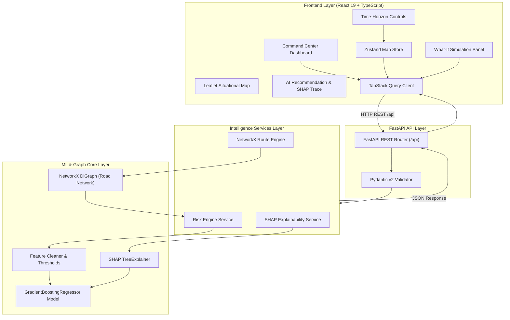
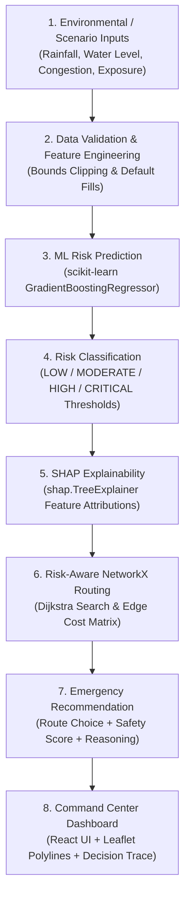

# AapdaNetra-X

**An Explainable AI-Driven Real-Time Disaster Intelligence and Emergency Response Optimization**

AapdaNetra-X is an open-source, research-grade decision-support platform designed for real-time disaster monitoring, flood risk evaluation, and evacuation planning. Built using a decoupled FastAPI + React architecture, the system combines **machine-learning risk prediction**, **SHAP explainability**, and **NetworkX graph-based route optimization** to help emergency operators evaluate evolving disaster scenarios.

> [!NOTE]
> **Research & Development Prototype Disclaimer**: AapdaNetra-X is currently operating in **Research-Grade Local Prototype Mode** using physics-informed synthetic hydro-meteorological datasets for software architecture, ML pipeline, and explainability evaluation. It is **not** currently certified for real-world life-safety emergency dispatch operations.


## 🌟 Key Capabilities

- **ML Disaster Risk Prediction**: `scikit-learn` GradientBoostingRegressor trained on multi-parameter hydro-meteorological inputs to predict continuous flood risk scores ($0 - 100$).
- **SHAP Explainability**: `shap.TreeExplainer` feature attributions providing decision trace explanations (*"Why did the system assign this risk score?"*).
- **NetworkX Evacuation Route Optimization**: Risk-aware graph Dijkstra search over road networks balancing travel time, road distance, traffic congestion, and flood hazard exposure. Supports both simulated 8-node representative graph and real-world **OpenStreetMap (OSM)** road networks via local GraphML caching.
- **Real-World Data Providers (Phase 6.1 & 6.2)**: Modular Adapter pattern supporting live OpenWeatherMap weather API, gauge water levels, and cached OpenStreetMap GIS road topology (`ROUTING_MODE=simulated|osm|auto`).
- **Time-Horizon Forecasting**: Dynamic risk, SHAP attributions, and evacuation path recalculation across `NOW`, `+10 MIN`, `+20 MIN`, `+30 MIN` projections.
- **What-If Scenario Simulation**: Counterfactual disaster simulator evaluating changes in rainfall intensity, evacuation pace, drainage efficiency, and road blockages.
- **Command Center UI**: Dark industrial glassmorphism dashboard built with React 19, Leaflet maps, and Recharts forecast timelines.

---

## 🏗️ System Architecture



---

## 🔬 Intelligence Pipeline

The core intelligence pipeline transforms physical hydro-meteorological inputs into explainable risk predictions and safe evacuation routes:



### Detailed Pipeline Stages

#### 1. Data / Scenario Inputs
The platform processes 7 core hydro-meteorological and spatial feature inputs:
- `rainfall_intensity` (mm/h)
- `rainfall_trend` (mm/h²)
- `water_level` (m above datum)
- `water_level_trend` (m/h)
- `road_congestion` (traffic ratio $0.0 - 1.0$)
- `population_exposure` (vulnerable population count)
- `infrastructure_vulnerability` (asset vulnerability ratio $0.0 - 1.0$)

#### 2. Feature Validation
Inputs are cleaned, bounded, and validated via `ml.features.validate_and_clean_features()`. Missing keys are filled safely with domain defaults, and extreme out-of-bounds inputs are clipped to prevent runtime exceptions.

#### 3. ML Risk Engine
The risk engine uses a `scikit-learn` `GradientBoostingRegressor` trained on a synthetic physics-informed flood risk dataset (1,000 samples, fixed random seed `42`). The model outputs a continuous flood risk score ($0.0 - 100.0$) and a calculated `prediction_reliability` metric ($0.50 - 0.98$).

#### 4. Risk Classification
Centralized threshold rules categorize predictions into operational emergency levels:
- **LOW**: $[0.0, 30.0)$
- **MODERATE**: $[30.0, 60.0)$
- **HIGH**: $[60.0, 85.0)$
- **CRITICAL**: $[85.0, 100.0]$

#### 5. SHAP Explainability
`shap.TreeExplainer` evaluates local feature contributions for each prediction. The SHAP service maps feature attributions to emergency-management labels (e.g. *Water Level*, *Rainfall Trend*) and calculates relative contribution percentages without inventing statistical probabilities.

#### 6. NetworkX Route Optimization
A `networkx.DiGraph` represents the local road network. Traversal edge costs dynamically incorporate road distance, travel time, road traffic congestion, structural blockages, and predicted flood hazard risk:
$$\text{Cost} = w_d \cdot \text{distance} + w_t \cdot \text{time} + w_r \cdot \left(\frac{\text{risk}}{100}\right) \times 15 + w_c \cdot \text{congestion} \times 10 + \text{BlockagePenalty}$$
NetworkX Dijkstra search finds the optimal recommended evacuation path and non-duplicate alternative routes.

#### 7. Command Center Visualizer
The React 19 dashboard renders situational heatmaps, recommended polyline evacuation paths, decision trace bars, forecast timelines, and what-if simulation controls.

---

## 🧪 Research & Technical Contribution

AapdaNetra-X explores the **integration of explainable machine learning and dynamic graph optimization into emergency decision-support systems**. 

While individual components (such as ML regression or pathfinding) are established in computer science literature, **unifying ML risk scoring, SHAP local feature attributions, NetworkX risk-aware graph routing, and counterfactual scenario simulation into a single time-horizon-aware decision pipeline** provides a practical software architecture model for emergency intelligence research.

---

## 📊 Current Implementation Status

| Component / Subsystem | Status | Details |
| :--- | :---: | :--- |
| **React Command Center Dashboard** | ✅ Complete | React 19 + TypeScript + Leaflet + Recharts + Zustand |
| **FastAPI REST Engine Backend** | ✅ Complete | Python 3.11/3.14 + Pydantic v2 validation |
| **Simulated Disaster Dataset** | ✅ Complete | 1,000 samples generated with physics-informed formula (seed 42) |
| **ML Risk Prediction Engine** | ✅ Complete | scikit-learn GradientBoostingRegressor artifact |
| **SHAP Explainability Layer** | ✅ Complete | shap.TreeExplainer feature attributions & decision trace |
| **NetworkX Route Optimization** | ✅ Complete | Dynamic Dijkstra path search over road graph |
| **What-If Scenario Simulation** | ✅ Complete | Counterfactual parameter modification & rerouting |
| **Automated Test Suite** | ✅ Complete | 30 passed unit and API integration tests (pytest) |
| **Real Weather Telemetry API** | 🔄 Planned | Phase 6 milestone |
| **Real River Gauge Sensor Feed** | 🔄 Planned | Phase 6 milestone |
| **OpenStreetMap / PostGIS Storage** | 🔄 Planned | Phase 6 milestone |
| **Real-Time WebSockets Sync** | 🔄 Planned | Phase 6 milestone |

---

## 🛠️ Technology Stack

- **Frontend**: React 19, TypeScript, Vite, Tailwind CSS, Leaflet, Recharts, Zustand, TanStack Query, Axios
- **Backend**: Python 3.11/3.14, FastAPI, Pydantic v2, Uvicorn, Pytest
- **Machine Learning**: `scikit-learn` (GradientBoostingRegressor), `joblib`, `numpy`, `pandas`
- **Explainability**: `shap` (TreeExplainer)
- **Routing**: `networkx` (DiGraph, Dijkstra / shortest_simple_paths)

---

## 📁 Repository Structure

```text
AapdaNetra-X/
├── frontend/                     # React 19 + TypeScript Client App
│   ├── src/
│   │   ├── components/           # UI Components (Map, Panels, Header, Charts)
│   │   ├── config/               # Navigation & app config
│   │   ├── hooks/                # Custom React hooks
│   │   ├── pages/                # CommandCenter & branded stub pages
│   │   ├── services/             # Axios API client functions
│   │   ├── store/                # Zustand global map & toast state
│   │   ├── types/                # TypeScript interface definitions
│   │   └── utils/                # Risk color helpers & formatters
│   ├── index.html                # Entry HTML
│   ├── package.json              # Frontend npm dependencies
│   └── vite.config.ts            # Vite build & API proxy setup
├── backend/                      # FastAPI Backend Application
│   ├── app/
│   │   ├── data/                 # Simulated disaster data sources
│   │   ├── models/               # Pydantic v2 request/response schemas
│   │   ├── routers/              # REST API route handlers
│   │   ├── services/             # Risk & simulation engine services
│   │   ├── config.py             # App environment configuration
│   │   └── main.py               # FastAPI entry point & CORS setup
│   ├── tests/                    # Pytest test suite (30 passed tests)
│   └── requirements.txt          # Python dependencies
├── ml/                           # ML & Explainability Subsystem
│   ├── features/                 # Feature specs, cleaner & risk thresholds
│   ├── training/                 # Data generator & GBR model training script
│   ├── models/                   # Serialized GBR model artifact & metadata
│   ├── inference/                # Model-agnostic risk predictor interface
│   ├── explainability/           # SHAP TreeExplainer service & mapping
│   └── routing/                  # NetworkX graph, cost functions & optimizer
├── docs/                         # Architecture documentation & diagrams
├── reference/                    # Immutable Visual Reference Prototype
├── README.md                     # Project README
└── .gitignore                    # Root gitignore rules
```

---

## 🌐 API Documentation

| Method | Endpoint | Query / Body Params | Description |
| :--- | :--- | :--- | :--- |
| `GET` | `/health` | None | System status, API version, and timestamp. |
| `GET` | `/api/incident` | None | Active disaster incident metadata. |
| `GET` | `/api/risk` | `horizon: int` ($0..3$) | Dynamic ML flood risk score, category, reliability, and heatmap zones. |
| `GET` | `/api/forecast` | None | Multi-point hazard risk timeline points ($0..60$ min). |
| `GET` | `/api/routes` | `horizon: int` ($0..3$) | NetworkX risk-optimized evacuation routes & SHAP decision trace. |
| `GET` | `/api/explainability` | `horizon: int` ($0..3$) | Detailed SHAP feature attributions and base value deltas. |
| `GET` | `/api/alerts` | None | Real-time emergency alert logs. |
| `POST` | `/api/response/approve` | `incidentId`, `responderId` | Response plan approval workflow trigger. |
| `POST` | `/api/simulation` | `evacuationPace`, `rainfallMultiplier`, `drainageEfficiency`, `routeBlockage` | Counterfactual What-If scenario ML simulation. |

---

## 🚀 Local Setup & Installation

### **1. Backend Server**
```bash
cd backend
source .venv/bin/activate
uvicorn app.main:app --host 0.0.0.0 --port 8000 --reload
```
*Access API Docs: `http://localhost:8000/docs`*

### **2. Frontend Dev Server**
```bash
cd frontend
npm install
npm run dev
```
*Access Application: `http://localhost:5173`*

### **3. Retrain ML Model (Optional)**
```bash
source backend/.venv/bin/activate
PYTHONPATH=. python ml/training/train.py
```

---

## 🧪 Testing & Verification Procedure

Execute the automated test suite and production build verification:

```bash
# Run 30 backend unit & integration tests
source backend/.venv/bin/activate
PYTHONPATH=.:backend pytest backend/tests

# Run frontend TypeScript type check & production build
cd frontend
npx tsc --noEmit
npm run build
```

---

## 🎮 Demo Workflow Guide for Evaluators

1. Open `http://localhost:5173` in your web browser.
2. Observe the current real-time risk score ($27.1$, LOW) on the top metric card and Leaflet situational map.
3. Click **APPROVE RESPONSE PLAN** to expand the **Decision Trace (SHAP Explainability)** panel.
4. Observe feature attributions (e.g. *Population Exposure $\downarrow 42\%$, Water Level $\uparrow 32\%$).
5. Click **+30 MIN** on the Time Horizon bar.
6. Observe risk score increase to $42.2$ (MODERATE), heatmap radii expansion, and SHAP decision trace ranking update (*Water Level $\uparrow 31\%$* becomes primary driver).
7. Scroll down to the **What-If Simulation** section.
8. Increase the **Rainfall Multiplier** slider to `1.8x`.
9. Toggle **Route Blockage** to `ON` and click **RUN SIMULATION**.
10. Observe risk delta ($+22.0$), updated narrative, and NetworkX rerouting to `Route B → F → G → H` (South Bypass).

---

## ⚠️ Current Limitations

- **Synthetic Datasets**: Hydro-meteorological sensor data is generated via deterministic equations for architecture testing.
- **Representative Topology**: Road network uses representative coordinates for Yamuna Floodplain (Sector B).
- **Local Deployment**: Artifacts and graphs run locally; PostGIS / cloud streaming infrastructure is planned for Phase 6.

---

## 🗺️ Project Roadmap

- **Phases 1–4**: Reference Prototype Analysis $\to$ Full-Stack Decoupled Architecture Conversion.
- **Phase 5A**: scikit-learn GradientBoostingRegressor Risk Engine.
- **Phase 5B**: SHAP TreeExplainer Explainability Service.
- **Phase 5C**: NetworkX Risk-Aware Evacuation Route Optimization.
- **Phase 5D**: System Integration Audit, Hardening & Documentation.
- **Phase 6A**: Real-World Sensor Telemetry & OpenStreetMap GIS Integration (Next).
