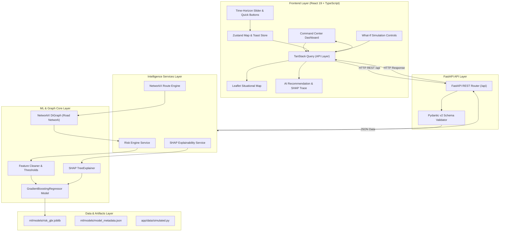
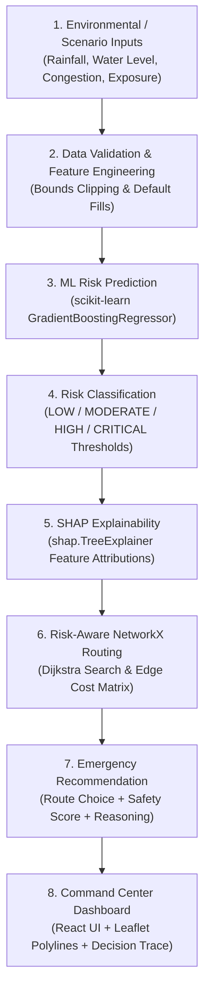
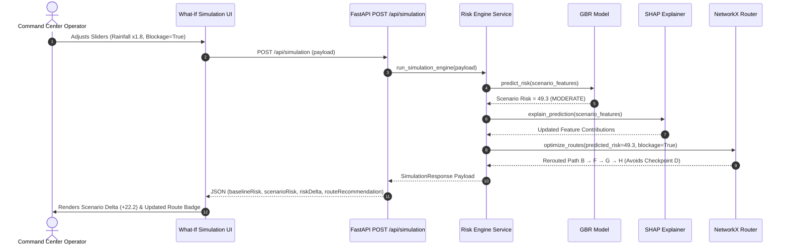
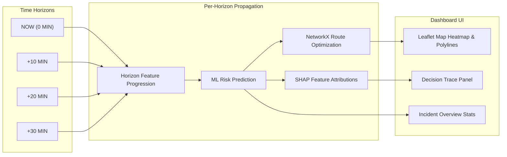

# AapdaNetra-X — System Architecture & Design Documentation

**Emergency Intelligence Platform — Full-Stack ML Disaster Monitoring & Response System**

> [!NOTE]
> **Research & Prototype Disclaimer**: AapdaNetra-X is currently operating in **Research-Grade Local Prototype Mode** using physics-informed synthetic hydro-meteorological data. Models and route calculations are evaluated for demonstration and software architecture validation, **not** for real-world emergency life-safety deployment.

---

## 1. High-Level Architecture Overview

AapdaNetra-X follows a clean, decoupled full-stack architecture comprising a **FastAPI Intelligence Engine backend** and a **React 19 + Vite + Leaflet Command Center frontend**.



---

## 2. Intelligence Pipeline Flow

The core intelligence pipeline transforms physical hydro-meteorological inputs into explainable risk predictions and safe evacuation routes:



---

## 3. What-If Simulation Pipeline



---

## 4. Time-Horizon Propagation Pipeline

Changing the time horizon recalculates model inferences across the entire system:



---

## 5. Repository Directory Architecture

```text
AapdaNetra-X/
├── frontend/                     # React 19 + TypeScript Client App
│   ├── src/
│   │   ├── components/           # UI Components (Map, Panels, Header, Charts)
│   │   ├── config/               # Navigation & app config
│   │   ├── data/                 # Client fallback simulated data
│   │   ├── hooks/                # Custom React hooks
│   │   ├── pages/                # CommandCenter & branded stub pages
│   │   ├── services/             # Axios API client functions
│   │   ├── store/                # Zustand global map & toast state
│   │   ├── types/                # TypeScript interface definitions
│   │   └── utils/                # Risk color helpers & formatters
│   ├── index.html                # Entry HTML
│   ├── package.json              # Frontend npm dependencies
│   └── vite.config.ts            # Vite build & API proxy setup
├── backend/                      # FastAPI Backend Application
│   ├── app/
│   │   ├── data/                 # Simulated disaster data sources
│   │   ├── models/               # Pydantic v2 request/response schemas
│   │   ├── routers/              # REST API route handlers
│   │   ├── services/             # Risk & simulation engine services
│   │   ├── config.py             # App environment configuration
│   │   └── main.py               # FastAPI entry point & CORS setup
│   ├── tests/                    # Pytest test suite (30 passed tests)
│   └── requirements.txt          # Python dependencies
├── ml/                           # ML & Explainability Subsystem
│   ├── features/                 # Feature specs, cleaner & risk thresholds
│   ├── training/                 # Data generator & GBR model training script
│   ├── models/                   # Serialized GBR model artifact & metadata
│   ├── inference/                # Model-agnostic risk predictor interface
│   ├── explainability/           # SHAP TreeExplainer service & mapping
│   └── routing/                  # NetworkX graph, cost functions & optimizer
├── docs/                         # Architecture documentation & diagrams
├── reference/                    # Immutable Visual Reference Prototype
└── README.md                     # Research Project README
```

---

## 6. Core Subsystems Specification

### **A. ML Risk Engine (`ml/inference/`, `ml/training/`, `ml/features/`)**
- **Algorithm**: `scikit-learn.ensemble.GradientBoostingRegressor` (120 estimators, max depth 4, learning rate 0.08).
- **Features (7)**: `rainfall_intensity`, `rainfall_trend`, `water_level`, `water_level_trend`, `road_congestion`, `population_exposure`, `infrastructure_vulnerability`.
- **Classification Thresholds**:
  - `LOW`: $[0.0, 30.0)$
  - `MODERATE`: $[30.0, 60.0)$
  - `HIGH`: $[60.0, 85.0)$
  - `CRITICAL`: $[85.0, 100.0]$
- **Reliability Calculation**: `prediction_reliability` ($0.50 - 0.98$) measures feature input completeness and margin distance from synthetic domain training bounds.

### **B. Explainable AI / SHAP Engine (`ml/explainability/`)**
- **Explainer**: `shap.TreeExplainer` on pre-trained GBR model artifact.
- **Additivity**: $\text{Model Prediction} = \text{Base Value} + \sum \text{SHAP}_i$.
- **Feature Attribution**: Maps technical feature keys to emergency-management domain labels and calculates relative contribution percentage:
  $$\text{Contribution \%}_i = \frac{|\text{SHAP}_i|}{\sum |\text{SHAP}_j|} \times 100$$

### **C. NetworkX Route Optimizer (`ml/routing/`)**
- **Graph Topology**: `networkx.DiGraph` representing Yamuna Floodplain road network.
- **Edge Cost Equation**:
  $$\text{Cost}_{u \to v} = w_d \cdot \text{distance} + w_t \cdot \text{time} + w_r \cdot \left(\frac{\text{risk}}{100}\right) \times 15 + w_c \cdot \text{congestion} \times 10 + \text{BlockagePenalty}$$
- **Routing Algorithm**: `networkx.shortest_simple_paths` (Dijkstra search) to compute recommended path and non-duplicate alternative evacuation routes.

---

## 7. API Endpoints Reference

| Method | Endpoint | Query / Body Params | Description |
| :--- | :--- | :--- | :--- |
| `GET` | `/health` | None | Returns operational status, API version, and timestamp. |
| `GET` | `/api/incident` | None | Active disaster incident metadata (Sector B Yamuna Floodplain). |
| `GET` | `/api/risk` | `horizon: int` ($0..3$) | Dynamic ML flood risk score, category, reliability, and heatmap zones. |
| `GET` | `/api/forecast` | None | Multi-point hazard risk timeline points ($0..60$ min). |
| `GET` | `/api/routes` | `horizon: int` ($0..3$) | NetworkX risk-optimized evacuation routes & SHAP decision trace. |
| `GET` | `/api/explainability` | `horizon: int` ($0..3$) | Detailed SHAP feature attributions and base value deltas. |
| `GET` | `/api/alerts` | None | Real-time emergency alert logs. |
| `POST` | `/api/response/approve` | `incidentId`, `responderId` | Triggers response plan workflow. |
| `POST` | `/api/simulation` | `evacuationPace`, `rainfallMultiplier`, `drainageEfficiency`, `routeBlockage` | Counterfactual What-If scenario ML simulation. |

---

## 8. Security & Robustness Summary

- **CORS Middleware**: Configured to restrict origins via `settings.cors_origins` (defaults to `http://localhost:5173`).
- **Input Validation**: Pydantic v2 schemas enforce boundary constraints on all incoming requests.
- **Out-of-Bounds Protection**: Feature validator clips extreme feature values to valid physical domain bounds without crashing.
- **Singleton Caching**: ML Model, TreeExplainer, and NetworkX Graph instance are loaded as global singletons to eliminate redundant disk I/O and initialization overhead.
